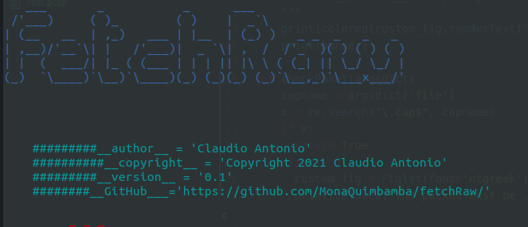
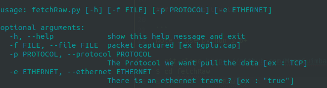
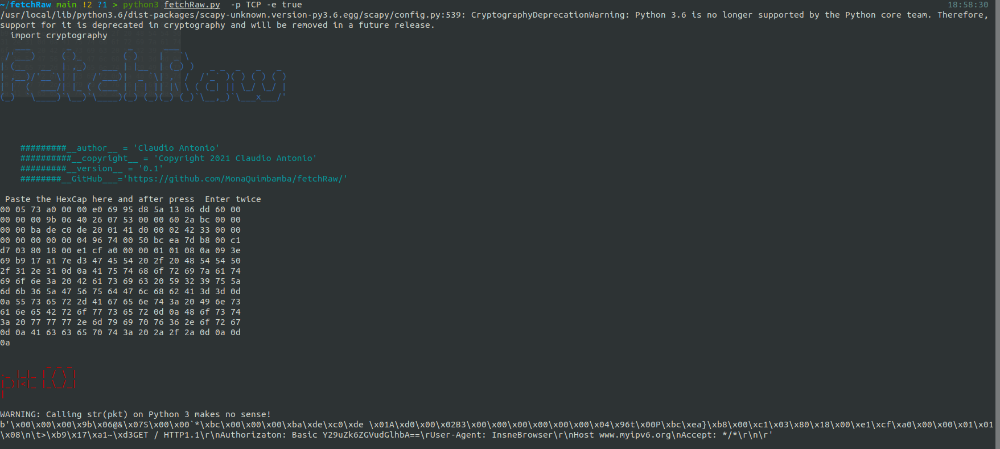
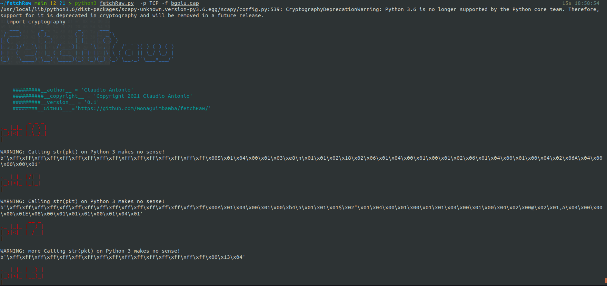

## fetchRaw :



### Key Features :


- Fetch datas from a network packet.

### Requirements :

*  Scapy https://github.com/secdev/scapy

*  python3 -m pip install pyfiglet

* python3 -m pip install termcolor


### Usage instructions :

```
Note : Use python 3.6+

$ git clone https://github.com/MonaQuimbamba/fetchRaw
$ cd fetchRaw
$ python3  fetchRaw.py -h
```



### Usage options :

### fetching data from layer 2 trame



#### fetching data from layer 3 packet


